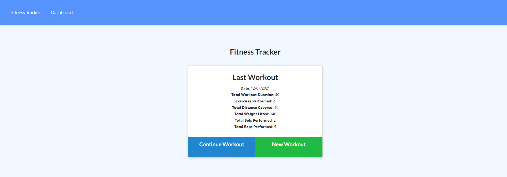
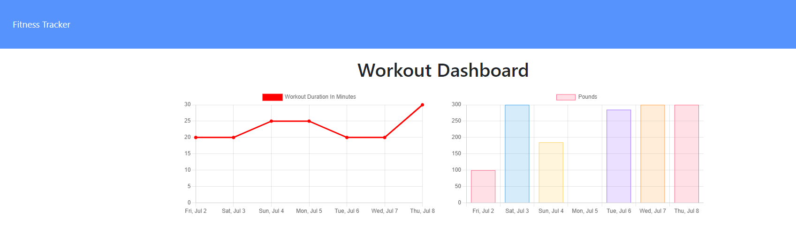

# Fitness Tracker

[](https://opensource.org/licenses/MIT)

## Description

This is an applicaion in which a user can track their fitness workouts.  The user is able to record multiple exercise workouts in a data recording different data depending on the type of workout.  The application will also allow a user to update, delete or obtain summary information about their workout.  From the dashboard the user will be able to retrieve statistics on their last seven workouts.

## 📖Table of Contents
1. [Installation](#installation)
2. [Usage](#usage)
3. [Assets](#assets)
4. [Technologies](#technologies)
5. [License](#license)
6. [Contributing](#contributing)
7. [Tests](#tests)
8. [Questions](#questions)

## Installation
1. To install this application clone it through GitHub using the following code in the terminal: 
    ``` 
    git clone git@github.com:Susanne85/workout-tracker.git
    ```
2. To add the dependencies to the application, navigate to the root directory for the application and run:
    ```js
    npm install
    npm install dotenv
    npm install express
    npm install mongo
    npm install nodemon
    ```
    
## Usage
Once the host, port, user, password and database details have been provided to the connection and the database has been created, navigate to the root directory for the application and run the following code in the terminal to start the application:
When executing the application in Node, the environment (env file) requires the mongo connection in the format 'MONGODB_URI= mongodb+srv://your mongo user name:your mongo Atlas password@cluster0.hnbwz.mongodb.net/your database bane?retryWrites=true&w=majority'.  Replace 'your mongo user name, your mongo Atlass password and your database' with the appropriate values.  The second variable in the environment file should be 'PORT=value' replacing value with an appropriate connection value.
 
```js
npm start
```
To execute the application on Heroku requires configuration variables for the connection to MongoDb to be added.  Login to Heroku and then click on the Settings tab and then click on the Config vars and then add a key value pair,  the key is 'MONGODB_URI', the value is mongodb+srv://your mongo user name:your mongo Atlas password@cluster0.hnbwz.mongodb.net/your database bane?retryWrites=true&w=majority'.  Replace the variables as described above.

## Assets

Live demo of the application hosted on Heroku:  Workout Tracker](https://my-workout-2021.herokuapp.com/)

The following images shows the functionality of the application: 




)


## Technologies
- [dotenv](https://www.npmjs.com/package/dotenv) 
- [Express](https://expressjs.com/)
- [Mongo](https://www.mongodb.com/)
- [Node.js](https://nodejs.org/en/docs/)
- [Nodemon](https://www.npmjs.com/package/nodemon)
- JavaScript

## License

This project is [MIT](./LICENSE) licensed

## Contributing
Contributions, issues and feature requests are welcome.

Feel free to check the [issues page](https://github.com/Susanne85/workout-tracker/issues) if you want to contribute.

## Tests

There are no tests currently for this application.

## Questions
For any questions, please contact the author:

- Github: [@Susanne](https://github.com/Susanne85)
